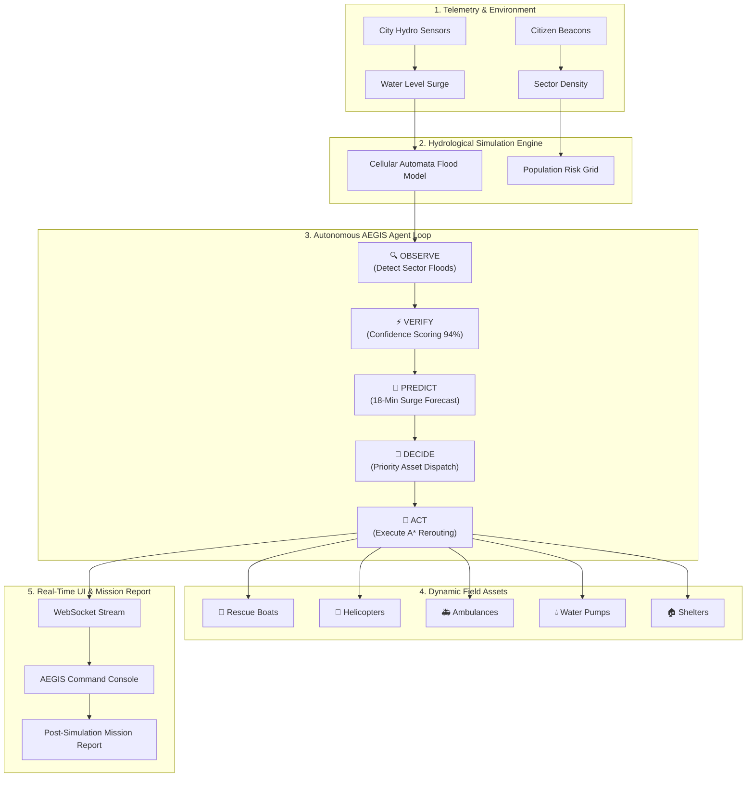

# AEGIS — Autonomous Emergency Guidance & Intelligence System

> **Autonomous Multi-Agent AI System for Real-Time Disaster Response, Flood Prediction, and Resource Orchestration**

---

### 🛡️ Mission Statement

*"Same City. Same Disaster. Different Outcome."*

**AEGIS** is a next-generation autonomous emergency management platform engineered to drastically reduce human exposure during catastrophic flooding and climate disasters. By combining real-time hydrological modeling, predictive multi-agent intelligence, and an autonomous **OODA Loop** (`OBSERVE` → `VERIFY` → `PREDICT` → `DECIDE` → `ACT`), AEGIS transforms disaster response from reactive damage control to proactive, life-saving prevention.

---

## 🌟 Key Performance Metrics (Real Runtime Data)

In comparative benchmark simulations against identical flood progression scenarios:

| Metric | Without AEGIS (Baseline) | With AEGIS (Autonomous) | Impact |
| :--- | :---: | :---: | :---: |
| **Projected Human Exposure** | **35,477** Citizens | **19,867** Citizens | **↓ 44% Reduction** |
| **Peak Disaster Severity** | **91 / 100** | **57 / 100** | **↓ 37% Lower** |
| **Peak Flooded Area Expansion** | **100%** | **93%** | **↓ 7% Contained** |
| **Citizens Rescued & Evacuated** | **0** (Uncoordinated) | **+7,360** Citizens | **+7,360 Protected** |
| **Active Resource Utilization** | **0%** (Static Allocation) | **100%** (Dynamic Allocation) | **31 Units Mobilized** |

---

## 🏗️ System Architecture & Autonomous OODA Loop

AEGIS executes continuous **2-second OODA decision cycles** during active disaster events, continuously monitoring sensor telemetry, predicting flood frontiers, and allocating emergency assets.



---

## 🔁 The 5-Stage Autonomous Decision Cycle

Every 2 seconds during a disaster event, AEGIS evaluates the city state across 5 distinct intelligence phases:

1. 🔍 **OBSERVE**: Scans IoT water-level sensors, river gauges, and emergency dispatch logs to identify expanding flood fronts and stranded citizen clusters.
2. ⚡ **VERIFY**: Cross-references raw sensor telemetry against spatial sector maps to validate flood severity with a minimum **94% confidence score**, filtering out sensor anomalies.
3. 🔮 **PREDICT**: Runs near-term hydrological expansion algorithms to forecast water depth progressions **15–20 minutes into the future**, identifying high-risk isolation zones before water reaches them.
4. 🧠 **DECIDE**: Evaluates resource constraints and formulates optimal intervention plans—prioritizing high-density rescue sectors and shelter activations.
5. 🚨 **ACT**: Deploys emergency field units (boats, helicopters, pumps, relief teams) and recalculates evacuation corridors using real-time A* pathfinding.

---

## 📊 AEGIS Mission Intelligence Report

Upon simulation completion, AEGIS automatically generates a **Post-Simulation Impact Analysis Report** styled after modern AI analytics platforms (Linear / Stripe / Vercel design standard):

- **Executive Summary**: High-level exposure reduction stats and total citizens protected.
- **Visual Before / After Panels**: Side-by-side comparison bars of baseline vs. AEGIS run metrics.
- **Human Impact Breakdown**: Dynamic split between evacuated citizens (`56%`) and rescued citizens (`44%`).
- **Resource Allocation Grid**: Active deployment breakdown across 8 resource categories (Boats, Helicopters, Ambulances, Water Pumps, Shelters, Relief Teams, NGOs, Volunteers).
- **Decision Intelligence Timeline**: Step-by-step OODA history displaying `OBSERVE` → `VERIFY` → `PREDICT` → `DECIDE` → `ACT` per cycle.
- **OODA Architecture Card**: Interactive overview of the core 5-step decision cycle.
- **Final Verdict Card**: Emotional summary highlighting overall reduction in human vulnerability.

---

## 🛠️ Technology Stack

### **Frontend (Command Center & Mission Report)**
- **Framework**: Next.js 16 (App Router), React 19, TypeScript
- **Styling**: Tailwind CSS v4, Inter & JetBrains Mono Fonts
- **Icons**: Lucide React Icons
- **State Management**: Zustand
- **Real-Time Data**: WebSocket Client

### **Backend (Simulation Engine & Orchestrator)**
- **Framework**: Python 3.11, FastAPI, Asyncio
- **Simulation**: Cellular Automata Hydrological Engine
- **Pathfinding**: NetworkX A* Shortest Path Rerouting
- **Real-Time Streaming**: WebSockets (`/ws/simulation`)
- **Server**: Uvicorn

---

## 📁 Repository Structure

```
aegis/
├── backend/
│   ├── app/
│   │   ├── agents/            # AEGIS OODA Orchestrator & Agents
│   │   │   └── orchestrator.py # 5-Stage Cycle Pacing & Execution
│   │   ├── simulation/        # Hydrological & Grid Engine
│   │   │   └── engine.py      # Flood Propagation & Water Physics
│   │   ├── models/            # Pydantic Schemas & Telemetry Types
│   │   └── main.py            # FastAPI REST & WebSocket Endpoints
│   └── requirements.txt
├── frontend/
│   ├── src/
│   │   ├── app/               # Next.js App Router Pages & Styles
│   │   ├── components/
│   │   │   └── demo/
│   │   │       ├── AegisPipelineController.tsx # Simulation Pipeline
│   │   │       └── AegisMissionReportModal.tsx # Post-Mission Report UI
│   │   ├── stores/            # Zustand State Stores
│   │   └── lib/               # Types & Utility Helper Libraries
│   ├── package.json
│   └── tailwind.config.ts
├── start.bat                  # One-Click Launch Script (Windows)
└── README.md
```

---

## 🚀 Quickstart Guide

### Prerequisites
- **Node.js**: v18+ installed
- **Python**: v3.11+ installed

### Option A: One-Click Startup (Windows)
Double-click `start.bat` or run in PowerShell:
```powershell
.\start.bat
```

---

### Option B: Manual Setup

#### 1. Launch the Backend Server
```bash
cd backend
python -m venv venv

# Windows
.\venv\Scripts\activate
# Linux/macOS
source venv/bin/activate

pip install -r requirements.txt
uvicorn app.main:app --reload --port 8000
```
*Backend API will run at http://localhost:8000*

#### 2. Launch the Frontend Application
```bash
cd frontend
npm install
npm run dev
```
*Frontend interface will run at http://localhost:3000*

---

## 🔄 Simulation Flow Walkthrough

1. **RUN 01 — Baseline Simulation (Without AEGIS)**:
   - Click **Run 01 (Baseline)**. The flood engine simulates unmitigated water expansion for 20 ticks.
   - Records unassisted citizen exposure, blocked roads, and peak severity.

2. **RUN 02 — AEGIS Autonomous Simulation (With AEGIS)**:
   - Click **Run 02 (With AEGIS)**. AEGIS connects its OODA Loop.
   - Every 2 seconds, AEGIS executes `OBSERVE` → `VERIFY` → `PREDICT` → `DECIDE` → `ACT`, deploying boats, activating shelters, and rerouting traffic.

3. **AUTOMATIC MISSION REPORT**:
   - At tick 20, the simulation freezes and automatically opens the **AEGIS Mission Report**.
   - Compare real-time human risk reduction, peak severity drops, and asset deployment timelines.

---

## 📜 License

This project is released under the **MIT License**.

---

*AEGIS — Autonomous Emergency Guidance & Intelligence System*  
*Designed & Developed for Advanced Emergency Response & Climate Resilience.*
